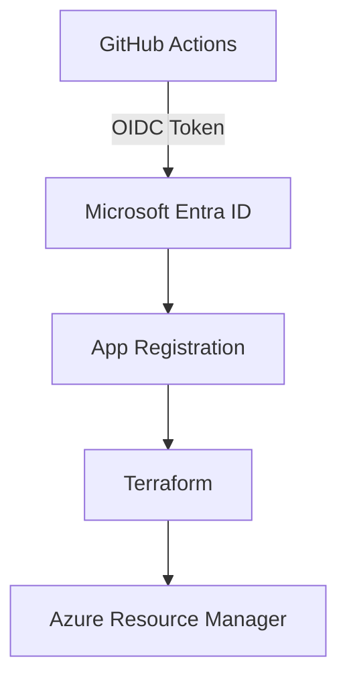

# Deploying and app using terraform and OIDC on Azure

### Abstract
This guideline intends to create a comprehensive way to create infrastructure on 
Azure by using OIDC (OpenID Connect) without storing secrets.

The test only creates a Resource Group, which has no cost. At the end, the infrastructure
is destroyed.

### Prerequistes
- An Azure account (Free account is sufficient).
- A GitHub account.
- A GitHub Repository.
- Azure CLI Installed.
- Terraform installed (>=1.5)

### Architecture


### Step 1 - Log into Azure
Login into azure and select the subscription to be used.
```bash
az login
# select the subscription to use and copy the ID.
az account set --subscription "<subscription-id>"
```
Verify that the login has worked and extract the subscription_id (id) and tenant_id (tenantId) for later:
```bash
az account show
```
```json
{
  "environmentName": "AzureCloud",
  "homeTenantId": "some-weird-value",
  "id": "some-weird-value",
  "isDefault": true,
  "managedByTenants": [],
  "name": "Azure subscription 1",
  "state": "Enabled",
  "tenantDefaultDomain": "youremailprovider.onmicrosoft.com",
  "tenantDisplayName": "Default Directory",
  "tenantId": "some-weird-value",
  "user": {
    "name": "youremail@provider.com",
    "type": "user"
  }
}
```

### Step 2 - Create an APP Registration
```bash
az ad create \
-- display-name terraform-oidc-demo
```
The output will provide you with the appId, save it for coming steps.

### Step 3 - Create the Service Principal
```bash
az ad sp create --id <APP_ID>
```

### Step 4 - Assign Permissions
For this demo we are going to assign "Contributor" on the subscription.
```bash
az role assigment create \
--assignee <APP_ID> \
--role Contributor \
--scope /subscriptions/<SUBSCRIPTION_ID>
```
### Step 5 - Configure Federated Credentials
On Azure Portal:
- Navigate to Microsoft Entra ID
- App Registrations
- Select terraform-oidc-demo (on the All Apps section)
- Certificats & Secrets
- Select on Federated Credentials and click on "add credential"
    - GitHub Actions
    - Organization: your-github-user
    - Repository: terraform-oidc-demo
    - Method: branch
    - Branch: main
    - Audience: (default) api://AzureADTokenExchange

### Step 6 - Create the repository
On Github create a repository named "terraform-oidc-demo" with the following structure:
```
├── main.tf
├── provider.tf
├── variables.tf
├── outputs.tf
└── .github
    └── workflows
        └── terraform.yml
```

### Step 7 - Terraform files
Include the following configuration on provider.tf
```terraform
terraform {
  required_version = "~>1.15.7"

  required_providers {
    azurerm = {
        source = "hashicorp/azurerm"
        version = "~>4.0"
    }
  }
}

provider "azurerm" {
  features {}

  use_oidc = true
}
```

Include the following configuration on main.tf
```terraform
resource "azurerm_resource_group" "demo" {
  name = "rg-oidc-demo"
  location = "West Europe"
}
```

Include the following configuration on outputs.tf
```terraform
output "resource_group_name" {
  value = azurerm_resource_group.demo.name
}
```

### Step 8 - Configure GitHub Secrets
Open your repository and navigate to:
- Settings > Secrets and Variables > Actions
Create the following repository secrets:
- AZURE_TENANT_ID <tenant_id>
- AZURE_CLIENT_ID <AppId>
- AZURE_SUBSCRIPTION_ID <SubscriptionID>

### Step 9 - Create the Workflow
Create the following path
`.github/workflows/terraform.yml`
```yml
name: Terraform

on:
  workflow_dispatch:

permissions:
  id-token: write
  contents: read

jobs:
  terraform:
    runs-on: ubuntu-latest

    env:
      ARM_USE_OIDC: true
      ARM_CLIENT_ID: ${{ secrets.AZURE_CLIENT_ID }}
      ARM_TENANT_ID: ${{ secrets.AZURE_TENANT_ID }}
      ARM_SUBSCRIPTION_ID: ${{ secrets.AZURE_SUBSCRIPTION_ID }}


    steps:
      - uses: actions/checkout@v4

      - uses: azure/login@v2
        with:
          client-id: ${{ secrets.AZURE_CLIENT_ID }}
          tenant-id: ${{ secrets.AZURE_TENANT_ID }}
          subscription-id: ${{ secrets.AZURE_SUBSCRIPTION_ID }}
      
      - uses: hashicorp/setup-terraform@v3

      - run: terraform init

      - run: terraform apply -auto-approve
```
Commit your changes and push them

### Step 10 - Run the Workflow
Navigate to Github actions, select your terraform action and run the workflow.

Verify in Azure Portal that your resource was properly created.

### Step 11 - Destroy the infrastructure
On the terraform.yml file replace the last step with:
`terraform destroy -auto-approve`

Run the workflow again.

### Step 12 - Azure Clean Up
Navigate to Azure Portal and clean up the environment.